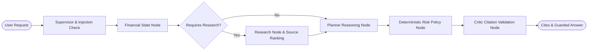

# AI and Research Architecture

## Module Boundary and Orchestration

The AI/Research capability is implemented across two backend modules:
- `backend/src/modules/planner`: Conversational planning orchestrator, LangGraph state graph, provider abstractions, closed tool registry, and risk/critic safety validators.
- `backend/src/modules/research`: Safe cited research engine, SSRF-defended document fetcher, DNS resolver, Tavily search provider, and source rank classifier.

Domain logic is decoupled from Express, BullMQ, and LLM vendor SDK types. Security-sensitive HTTP transports, DNS lookup functions, provider adapters, and clocks are dependency-injected; persistence services use the established Drizzle database boundary.

## Provider Abstraction and Fallback Boundaries

The vendor-neutral `LlmProvider` contract is implemented by `OpenAiLlmAdapter` (primary) and `GeminiLlmAdapter` (fallback), orchestrated by `FallbackLlmRouter`:
- **Fallback Trigger Conditions**: HTTP 429 (rate limits), HTTP 5xx (transient errors), timeouts, network connectivity failures, and structured JSON parsing/schema validation errors.
- **Strict Non-Fallback Prohibitions**:
  - Authentication and configuration errors (HTTP 401/403) fail immediately.
  - Prompt injection detection or policy violations fail closed immediately.
  - Unauthorized tool execution attempts fail closed.
  - Caller cancellation signals (`AbortError`) abort immediately.
  - **No switching providers after user-visible output begins**: Fallback is prohibited once the first visible token or chunk is emitted to the user.
  - At most one primary attempt and one fallback attempt per reasoning stage.

## Closed Typed Tool Authorization

Models invoke tools exclusively from a closed, strictly validated registry:
1. `get_current_plan`: Reads active household plan and current financial snapshot.
2. `calculate_cash_flow`: Deterministic cash flow, fixed obligations, and surplus calculation.
3. `calculate_emergency_fund`: Target reserve months, runway, and funding shortfall calculation.
4. `calculate_loan_amortization`: EMI, interest payable, and amortization schedule calculation.
5. `calculate_investment_projection`: Compound investment growth and milestone projection.
6. `calculate_goal_funding`: Goal inflation adjustment, future cost, and SIP requirement.
7. `calculate_net_worth`: Asset and liability aggregation.
8. `search_market_research`: Bounded search query for financial facts.

**Strict Security Constraints**:
- Model tools cannot execute arbitrary SQL queries, raw HTTP requests, filesystem access, scenario applications, or baseline/plan mutations.
- Tool arguments are validated against strict Zod schemas with `additionalProperties: false` (unknown arguments trigger immediate failure).

## SSRF Defense & Safe Fetch Engine

Document fetching for cited research enforces comprehensive multi-layered SSRF defenses:
- **Protocol & Port Enforcement**: Strict HTTPS scheme only; default port 443 only.
- **Credential Stripping**: URL userinfo (`user:pass@`) is strictly prohibited.
- **IP Literal Blocking**: IPv4/IPv6 literals in hostnames are rejected immediately.
- **Private & Reserved IP Blocking**: Rejects loopback (`127.0.0.0/8`, `::1`), RFC 1918 (`10.0.0.0/8`, `172.16.0.0/12`, `192.168.0.0/16`), link-local (`169.254.0.0/16`, `fe80::/10`), unique-local (`fc00::/7`), CGNAT (`100.64.0.0/10`), multicast (`224.0.0.0/4`, `ff00::/8`), documentation/benchmarking subnets, and IPv4-mapped IPv6 ranges.
- **DNS Rebinding Defense**: Hostnames are resolved repeatedly through injected DNS lookups, all answers must remain identical and public, and the default HTTPS transport pins connection establishment to a validated address while retaining the hostname for TLS verification.
- **Redirect Policy**: Redirects are followed with full URL and DNS validation up to a maximum of 3 hops; cross-scheme downgrades (HTTPS → HTTP) and redirect loops are aborted.
- **Payload Constraints**: Max response body size of 512 KB; non-textual/binary content types (`application/octet-stream`, images, audio, video) are rejected.
- **Sanitization**: Script, style, svg, header, nav, footer, and active HTML tags are stripped, entities decoded, and whitespace normalized before storing.

## Source Ranking & Evidence Hierarchy

Evidence is classified and sorted according to authority:
1. `government_regulator`: RBI, SEBI, Income Tax Department, PFRDA, EPFO, MoF (Rank 1).
2. `exchange_official_filing`: NSE, BSE official disclosures (Rank 2).
3. `official_provider`: AMFI, NPS Trust, LIC, CAMS, Karvy (Rank 3).
4. `structured_finance_api`: Verified market data APIs (Rank 4).
5. `reputable_publication`: Livemint, Economic Times, Moneycontrol, Reuters, Bloomberg (Rank 5).
6. `community`: Public blogs and unverified forums (Rank 6).

Evidence sorting prioritizes: `source_type_rank ASC` → `confidence DESC` → `created_at ASC`.

## Risk & Critic Safety Policies

- **Risk Validator**: Deterministically blocks advice containing:
  - Individual security or equity buy/sell recommendations.
  - Return guarantees or claims of "risk-free" profit.
  - Autonomous trading or execution promises.
- **Critic Validator**: Validates all citations in assistant responses:
  - Evidence IDs must exist and belong to the calling household.
  - Evidence must not have exceeded the 30-day freshness expiration window.
  - Canonical URLs must match persisted evidence records.
  - Duplicate citation IDs within the same response are rejected.
  - Factual regulatory/tax claims require explicit evidence citations.

## Data Retention & Tenant Isolation

- **Composite Tenant Keys**: Child records enforce composite tenant foreign keys, including messages to conversations, evidence to research runs, and message citations to both messages and evidence.
- **90-Day Retention**: All conversations, messages, research runs, and evidence carry a `retention_expires_at` timestamp. Expired records are filtered from query results and purged in scheduled batches.
- **30-Day Freshness**: Evidence carries `freshness_expires_at` (`retrieved_at + 30 days`).
- **Privacy & Observability**: Hidden internal chain-of-thought reasoning, vendor raw traces, and system prompts are never persisted to the database, returned in API responses, or leaked to logs.
